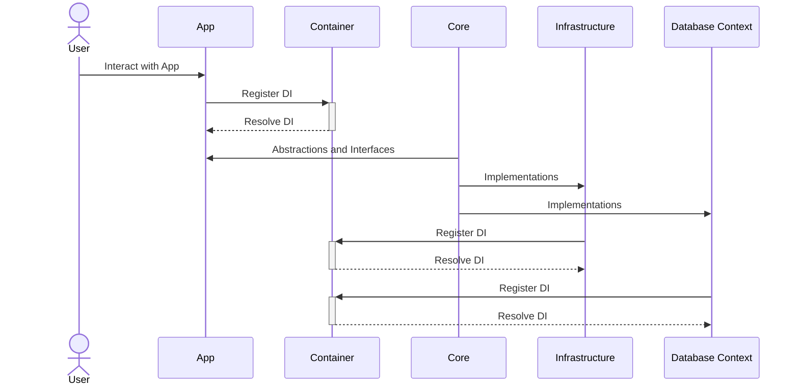

# Source Code Organization

This document outlines the structure of the application's source code. The repository is organized into several top-level directories, each serving a specific purpose.

---

## **Architecture**

Below is a high-level representation of the application architecture:




---

Directory structure:


```
├── src/
│   ├── App/
│   │   ├── Program.cs
│   │   ├── Assets/
│   │   ├── Extensions/
│   │   ├── Forms/
│   │   └── Handlers/
│   ├── Core/
│   │   ├── Abstractions/
│   │   │   ├── Events/
│   │   │   ├── Services/
│   │   │   └── Stores/
│   │   ├── Constants/
│   │   ├── Enums/
│   │   │   └── Win32/
│   │   ├── Extensions/
│   │   ├── Helpers/
│   │   ├── Structs/
│   │   ├── Win32/
│   │   │   ├── API/
│   │   │   └── Controls/
│   │   └── Wrappers/
│   └── Infrastructure/
│       ├── Infrastructure.csproj
│       ├── Controls/
│       │   └── Logger/
│       ├── Extensions/
│       ├── Services/
│       └── Stores/
└── test/
```

### **src/**
The `src` directory contains all the main source code of the application. It is structured into the following layers:

---

### **App/**
The `App` layer contains all application-specific logic, user interfaces, and core entry points.

- **Dependencies/**:
  Third-party libraries or packages required by the `App` layer.

- **Assets/**:
  Static assets such as images, icons, fonts, and other resource files.

- **Components/**:
  Reusable user interface components that are shared across the application.

- **Extensions/**:
  Extension methods tailored to the `App` layer for enhancing functionality.

- **Forms/**:
  UI-specific classes or Windows Forms utilized in the application.

- **Handlers/**:
  Event handlers and classes responsible for handling application-level commands or events.

- **Shared/**:
  Shared resources used by other folders in the `App` layer.

- **Program.cs**:
  The application's entry point.

---

### **Core/**
The `Core` layer represents the domain and business logic of the application.

- **Abstractions/**:
  Interfaces and abstract classes defining contracts for business logic.

- **Constants/**:
  Static values used across the domain layer, such as predefined keys or settings.

- **Enums/**:
  Enumeration definitions for domain-specific logic.

- **Extensions/**:
  Domain-specific extension methods.

- **Helpers/**:
  Helper classes for common business logic operations.

- **Structs/**:
  Custom value types (structures) defined for domain-specific scenarios.

- **Win32/**:
  Interop or P/Invoke definitions for interacting with Windows APIs.

- **Wrappers/**:
  Wrappers for external libraries or services.

---

### **Infrastructure/**
The `Infrastructure` layer provides implementations for external systems, such as data storage, API integrations, and other low-level concerns.

- **Dependencies/**:
  Third-party libraries or dependencies required by the `Infrastructure` layer.

- **Controls/**:
  Custom controls that extend UI capabilities related to the infrastructure.

- **Extensions/**:
  Extension methods for low-level operations or integration-specific tasks.

- **Services/**:
  Implementations of services and APIs that interact with external systems.

- **Stores/**:
  Classes managing state or data storage mechanisms.

---

### **test/**
The `test` directory contains unit and integration tests to ensure the reliability of the application.

---

## **Design Principles**

The architecture is organized based on the following principles:

1. **Separation of Concerns**:
   - The codebase is divided into logical layers: `App`, `Core`, and `Infrastructure`.
   - Each layer has a specific responsibility to reduce coupling and enhance maintainability.

2. **Reusability**:
   - Reusable components, helpers, and extensions are shared across relevant layers.

3. **Scalability**:
   - The modular structure allows easy addition of features or layers without major refactoring.

4. **Testability**:
   - The `test` directory ensures that every layer of the application is covered by unit or integration tests.

5. **Clarity**:
   - A consistent folder structure and naming convention make the codebase easier to navigate.

---

## **Future Enhancements**

1. Add documentation to each folder for specific details about their contents.
2. Include diagrams for visualizing relationships between layers.
3. Expand the test suite to improve coverage for critical features.
4. Add CI/CD pipelines for automated testing and deployment.
