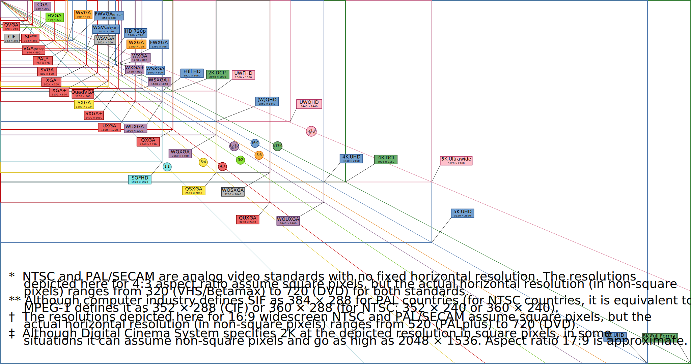

# Common Display Resolutions

This document provides a list of common display resolutions used for computer and handheld screens.

## Computer and Handheld Screens

| Resolution Name | Width (px) | Height (px) | Aspect Ratio | Notes                                     |
| --------------- | ---------- | ----------- | ------------ | ----------------------------------------- |
| QQVGA           | 160        | 120         | 4:3          | Quarter of QVGA                           |
| HQVGA           | 240        | 160         | 3:2          | Half-QVGA, used in Game Boy Advance       |
| QVGA            | 320        | 240         | 4:3          | Common in early PDAs                      |
| WQVGA           | 400        | 240         | 5:3          | Wide QVGA, used in some portable devices  |
| HVGA            | 480        | 320         | 3:2          | Half of VGA, used in early iPhones        |
| VGA             | 640        | 480         | 4:3          | Standard for early PCs                    |
| WVGA            | 800        | 480         | 5:3          | Wide VGA, used in many smartphones        |
| FWVGA           | 854        | 480         | 16:9         | Full Wide VGA, common for Android devices |
| SVGA            | 800        | 600         | 4:3          | Super VGA                                 |
| XGA             | 1024       | 768         | 4:3          | Extended Graphics Array                   |
| WXGA            | 1280       | 800         | 16:10        | Wide XGA, common in widescreen laptops    |
| HD              | 1280       | 720         | 16:9         | High Definition                           |
| SXGA            | 1280       | 1024        | 5:4          | Super XGA                                 |
| WXGA+           | 1440       | 900         | 16:10        | Widescreen XGA+                           |
| HD+             | 1600       | 900         | 16:9         | High Definition Plus                      |
| UXGA            | 1600       | 1200        | 4:3          | Ultra Extended Graphics Array             |
| Full HD         | 1920       | 1080        | 16:9         | Common for TVs and monitors               |
| WUXGA           | 1920       | 1200        | 16:10        | Wide Ultra Extended Graphics Array        |
| QHD             | 2560       | 1440        | 16:9         | Quad HD, used in high-end smartphones     |
| UHD 4K          | 3840       | 2160        | 16:9         | Ultra HD 4K                               |
| UHD 8K          | 7680       | 4320        | 16:9         | Ultra HD 8K, used in high-end televisions |
